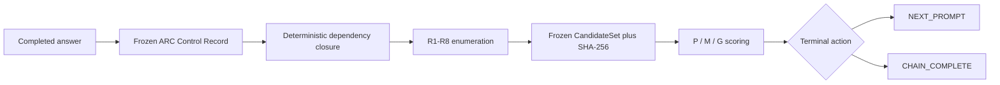

# ARC-CEB-1.0

[](https://github.com/donaldtuttle/ARC-CEB-1.0/releases/tag/v1.0-LOCKED_NOT_EXECUTED)


[](LICENSE)

> **Freeze the record. Enumerate the boundary. Hash the result.**

ARC-CEB-1.0 is a deterministic conformance protocol for deciding whether an ARC-controlled answer contains a residual issue that justifies one more prompt. Instead of asking a model to reread prose and freely notice possible defects, it enumerates a closed R1-R8 defect boundary from a frozen typed record, hashes the resulting candidate set, and then gives independent scorers a fixed object to evaluate.

The current release is **locked but not executed**. The packages and preregistration are frozen; independent replication and scorer runs remain pending. No final ARC conformance claim has been made.

## Start here

| Goal | Open |
|---|---|
| Understand the protocol | [`docs/ARC-CEB-1.0-SPEC.md`](docs/ARC-CEB-1.0-SPEC.md) |
| Inspect the preregistered test | [`docs/PREREGISTRATION.md`](docs/PREREGISTRATION.md) |
| Review all 24 expected cases | [`docs/CASE_MATRIX.md`](docs/CASE_MATRIX.md) |
| Load the agent skill | [`SKILL.md`](SKILL.md) · [`skills/arc-ceb/`](skills/arc-ceb/) |
| Download the frozen packages | [`v1.0-LOCKED_NOT_EXECUTED`](https://github.com/donaldtuttle/ARC-CEB-1.0/releases/tag/v1.0-LOCKED_NOT_EXECUTED) |
| Verify the release pins | [`release/HASHES.md`](release/HASHES.md) |

> **Blind-scoring warning:** `docs/CASE_MATRIX.md` contains expected classifications and reference actions. Do not provide it to blind scorers.

## Agent skill

`SKILL.md` is the agent-facing contract for ARC-CEB-1.0. It tells Claude, ChatGPT, Codex, Cursor, Grok, and any [agentskills.io](https://agentskills.io) host to freeze the record, enumerate R1–R8, hash the CandidateSet, and refuse free-form audits.

The portable pack is [`skills/arc-ceb/`](skills/arc-ceb/SKILL.md). Folder name must match the YAML `name` field `arc-ceb`. Canonical weight remains none. The skill does not execute the locked suite and is not `Enum_CEB_1`.

Authority boundary: [`docs/agent-skill.md`](docs/agent-skill.md). Install notes: [`skills/arc-ceb/references/install.md`](skills/arc-ceb/references/install.md).

This is editorial packaging. It does not alter tagged release bytes, `LOCK.json`, or the published ZIP hashes.

## Why ARC-CEB exists

A free-form audit is not reproducible. Two evaluators can reread the same answer and notice different problems, or the same evaluator can produce a different list on a second pass.

ARC-CEB separates **candidate generation** from **candidate scoring**:

| Recall-based audit | ARC-CEB-1.0 |
|---|---|
| Rereads prose and notices issues opportunistically | Reads a frozen ARC Control Record |
| Candidate discovery can vary between runs | R1-R8 triggers are deterministically enumerated |
| The search boundary is implicit | The dependency boundary is declared and finite |
| Scoring and discovery can blur together | The `CandidateSet` is frozen and hashed before scoring |
| Stopping can become open-ended | Output is exactly `NEXT_PROMPT` or `CHAIN_COMPLETE` |

This makes a narrow question testable: **Did identical frozen records produce identical ordered candidate sets, and did independent scorers agree often enough on whether to continue?**

## How it works



`Enum_CEB_1` is specified as a pure function:

```text
identical record bytes + identical generator version
                         ↓
identical ordered candidate list + identical candidate-set hash
```

The generator determines **which candidates exist**. The scorer determines **whether the highest-value unresolved candidate warrants another step**. A scorer may not add an interesting issue that lies outside the frozen boundary.

## Status at a glance

| Item | Value |
|---|---|
| Protocol | `ARC-CEB-1.0` |
| Conformance suite | `ARC-CEB-CONF-1.0` |
| Protocol maturity | `DEVELOP` |
| Release state | `LOCKED_NOT_EXECUTED` |
| Static review | `STATIC_PASS` |
| Replication | `PENDING_REPLICATION` |
| Independent scorers | `PENDING_SCORERS` |
| Frozen cases | `24` |
| Freeze date | `2026-08-22` |
| Canonical weight | None |

## The eight residual-defect classes

The generator has exactly eight classes. There is no free-form `OTHER` or `MISC` bucket.

| Class | Defect | Operational question |
|---|---|---|
| **R1** | Support gap | Is a load-bearing claim unsupported or its evidence unverified? |
| **R2** | Untested assumption | Does the conclusion depend on an assumption without a valid completed test? |
| **R3** | Undefined operative term | Is a term doing logical work without a registered definition? |
| **R4** | Alternative or confound gap | Are alternatives, confounds, or discriminating tests missing or unresolved? |
| **R5** | Missing failure or rejection condition | Is a required falsifier, failure gate, or rejection rule absent? |
| **R6** | Scope-bridge gap | Does evidence from one scope support a claim in another without a valid bridge? |
| **R7** | Internal inconsistency | Does the record contain a cycle, polarity conflict, or incompatible claim? |
| **R8** | Operationalization, measurement, or realization gap | Is the measurement, proxy, implementation, or realization bridge missing or invalid? |

Issues outside R1-R8 are recorded as `OUT_OF_BOUNDARY` and cannot change the current terminal action. The suite tests exhaustiveness over the declared record and classes, not exhaustiveness over reality.

## Frozen 24-case design

| Category | Count | Frozen contract |
|---|---:|---|
| Clean | 2 | Zero emitted candidates |
| Single-defect R1-R8 | 16 | Two cases per class, exactly one emitted candidate |
| Overlapping defects | 3 | Two or more emitted candidates |
| Unique headline-invalidating | 3 | Exactly one candidate whose unresolved defect defeats the headline |
| **Total** | **24** | Fixed scorer denominator |

“Single-defect” means one emitted candidate, not necessarily one trigger code. Multiple trigger codes may collapse into one candidate when they share the same target and class.

## Preregistered hard rejection gates

| Gate | Reject ARC-CEB-1.0 when... |
|---|---|
| **H1 - Candidate-hash determinism** | Identical frozen records produce different candidate-set hashes, or independent conforming implementations diverge. |
| **H2 - Fatal-defect class coverage** | A confirmed unique headline-invalidating defect cannot be represented by R1-R8. |
| **H3 - Terminal-action agreement** | At least three isolated scorers disagree on `NEXT_PROMPT` versus `CHAIN_COMPLETE` in 3 or more of the 24 cases. |

Selected-candidate agreement, exact P/M/G agreement, false-continuation rate, false-stop rate, and related measures are diagnostics. They are not additional hard gates in version 1.0.

## Download the locked release

The executable and blind-scoring materials live in the GitHub Release rather than on the `main` branch.

| Asset | Purpose | SHA-256 |
|---|---|---|
| [`ARC_CEB_1_0_CONFORMANCE_SUITE.zip`](https://github.com/donaldtuttle/ARC-CEB-1.0/releases/download/v1.0-LOCKED_NOT_EXECUTED/ARC_CEB_1_0_CONFORMANCE_SUITE.zip) | Frozen conformance suite and audit materials | `dc3fd6d09bbebd344e48fffe92a1dec128622b1f5daa10ffacbb9c11b34ac800` |
| [`ARC_CEB_1_0_SCORER_PACKET.zip`](https://github.com/donaldtuttle/ARC-CEB-1.0/releases/download/v1.0-LOCKED_NOT_EXECUTED/ARC_CEB_1_0_SCORER_PACKET.zip) | Blind packet for isolated scorers | `51ef04911c9fd89bd68dffaacccecd8a4b8af35989fb5a516b60e30c78c7fba7` |

Internal lock-file pin:

```text
LOCK.json
SHA-256: 68c1e5cc3c848c980381d45dc9216430a0bebdae0d95c4188bcb62a25e8b355c
```

Verify the downloaded ZIP files before opening or distributing them:

```bash
# macOS
shasum -a 256 ARC_CEB_1_0_CONFORMANCE_SUITE.zip
shasum -a 256 ARC_CEB_1_0_SCORER_PACKET.zip

# Linux
sha256sum ARC_CEB_1_0_CONFORMANCE_SUITE.zip
sha256sum ARC_CEB_1_0_SCORER_PACKET.zip
```

```powershell
# Windows PowerShell
Get-FileHash .\ARC_CEB_1_0_CONFORMANCE_SUITE.zip -Algorithm SHA256
Get-FileHash .\ARC_CEB_1_0_SCORER_PACKET.zip -Algorithm SHA256
```

## Execution path

1. Download both release assets and verify their SHA-256 hashes.
2. Keep the scorer packet isolated from the case matrix, expected outputs, and implementation materials.
3. Run the frozen records through the reference enumerator and at least one independently written conforming enumerator.
4. Confirm byte-identical ordered candidate sets and candidate-set hashes.
5. Give the blind packet to at least three isolated scorers.
6. Apply H1-H3 exactly as preregistered, without moving thresholds after observing results.
7. Publish the full result record, including failures and non-rejection diagnostics.

## Claim boundary

A future `FINAL_PASS` would support only this narrow claim:

> ARC-CEB-1.0 deterministically enumerated the declared R1-R8 defects on the frozen 24-case suite, and independent scorers exceeded the preregistered terminal-action agreement threshold.

It would **not** establish that:

- R1-R8 exhaust every possible reasoning defect
- ARC improves task outcomes
- P/M/G scores are universally calibrated
- internal model reasoning changed
- the protocol generalizes beyond the frozen fixtures
- QOFT canon, physical claims, or unrelated theoretical claims are validated

## Repository map

| Path | Purpose |
|---|---|
| [`README.md`](README.md) | Plain-language front door, status, downloads, and execution path |
| [`SKILL.md`](SKILL.md) | Agent skill contract: freeze, enumerate R1–R8, hash |
| [`skills/arc-ceb/`](skills/arc-ceb/SKILL.md) | Portable agentskills.io pack |
| [`docs/ARC-CEB-1.0-SPEC.md`](docs/ARC-CEB-1.0-SPEC.md) | Protocol specification and deterministic boundary |
| [`docs/PREREGISTRATION.md`](docs/PREREGISTRATION.md) | Frozen suite design, gates, and claim boundary |
| [`docs/CASE_MATRIX.md`](docs/CASE_MATRIX.md) | Expected category, trigger coverage, candidate count, and terminal action for all 24 cases |
| [`docs/agent-skill.md`](docs/agent-skill.md) | Authority boundary for the agent skill |
| [`release/HASHES.md`](release/HASHES.md) | SHA-256 pins for the two ZIP packages and `LOCK.json` |
| [`LICENSE`](LICENSE) | MIT License |
| [GitHub Release](https://github.com/donaldtuttle/ARC-CEB-1.0/releases/tag/v1.0-LOCKED_NOT_EXECUTED) | Frozen binary packages under tag `v1.0-LOCKED_NOT_EXECUTED` |

## Freeze and versioning

Treat the tagged release, its assets, and its published hashes as the frozen ARC-CEB-1.0 object. Main-branch editorial improvements do not alter those tagged bytes. Any future change to the protocol, fixtures, scorer anchors, thresholds, expected outputs, generator, or validator requires a new version, new lock record, and new hashes.

## QOFT relationship

ARC-CEB-1.0 uses the QOFT methodology distinction between sampler-based recall and deterministic enumeration over a declared boundary. It is classified as a **QOFT Typed Realization candidate** with **canonical weight: none**.

It does not amend QOFT notation, operators, or canon. That relationship describes methodological provenance only.

## License

ARC-CEB-1.0 is released under the [MIT License](LICENSE). The software and documentation are provided without warranty.
